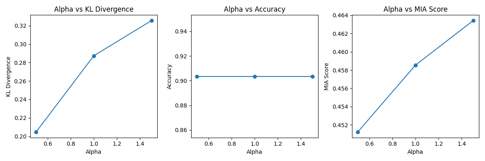

# Unlearning Experiment Report

## Overview

This document summarizes the results of federated unlearning experiments using the agnostic method on the Breast Cancer dataset. The experiments evaluate the trade-off between model utility and privacy as measured by accuracy, MIA (Membership Inference Attack) score, and forgetting score (KL divergence), for different values of the agnostic update parameter `alpha`.

## Experiment Settings

- **Dataset:** Breast Cancer Wisconsin (Diagnostic)
- **Clients:** 5
- **Unlearning Targets:** Clients 2 and 3
- **Agnostic Method:** Weight difference with varying `alpha`
- **Metrics:**
  - **Accuracy:** Model accuracy on the test set
  - **MIA Score:** Membership inference attack accuracy
  - **Forgetting Score:** KL divergence and mean probability drop on unlearned clients' data

## Results

The following plot visualizes the effect of `alpha` on forgetting and utility:



- **Alpha vs KL Divergence:** Measures how much the model's output distribution changed for the unlearned clients.
- **Alpha vs Accuracy:** Shows the impact on overall model utility.
- **Alpha vs MIA Score:** Indicates privacy improvement (lower is better).

## Observations

- Increasing `alpha` generally increases forgetting (higher KL), but may reduce accuracy.
- MIA score typically decreases as forgetting increases, indicating improved privacy for unlearned clients.
- There is a trade-off between utility (accuracy) and privacy (forgetting, MIA).

## How to Reproduce

1. Run `main.py` to perform federated training, unlearning, and evaluation.
2. The script will save the plot as `unlearning_forgetting_analysis.png` and print detailed metrics to the console.

---
```# filepath: /home/sibi/Documents/mul/Machine-Unlearning/unlearning_experiment_report.md
# Unlearning Experiment Report

## Overview

This document summarizes the results of federated unlearning experiments using the agnostic method on the Breast Cancer dataset. The experiments evaluate the trade-off between model utility and privacy as measured by accuracy, MIA (Membership Inference Attack) score, and forgetting score (KL divergence), for different values of the agnostic update parameter `alpha`.

## Experiment Settings

- **Dataset:** Breast Cancer Wisconsin (Diagnostic)
- **Clients:** 5
- **Unlearning Targets:** Clients 2 and 3
- **Agnostic Method:** Weight difference with varying `alpha`
- **Metrics:**
  - **Accuracy:** Model accuracy on the test set
  - **MIA Score:** Membership inference attack accuracy
  - **Forgetting Score:** KL divergence and mean probability drop on unlearned clients' data

## Results

The following plot visualizes the effect of `alpha` on forgetting and utility:


- **Alpha vs KL Divergence:** Measures how much the model's output distribution changed for the unlearned clients.
- **Alpha vs Accuracy:** Shows the impact on overall model utility.
- **Alpha vs MIA Score:** Indicates privacy improvement (lower is better).

## Observations

- Increasing `alpha` generally increases forgetting (higher KL), but may reduce accuracy.
- MIA score typically decreases as forgetting increases, indicating improved privacy for unlearned clients.
- There is a trade-off between utility (accuracy) and privacy (forgetting, MIA).

## How to Reproduce

1. Run `main.py` to perform federated training, unlearning, and evaluation.
2. The script will save the plot as `unlearning_forgetting_analysis.png` and print